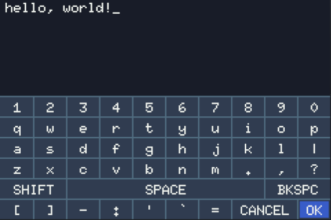

# luxboard lite

A more user friendly version of [luxboard](https://codeberg.org/nanobot567/luxboard) :)

## User guide

Depending on the input method the developer has chosen, the touchpad can be mapped one of two ways: as an 8-way d-pad controlling the position of the highlighted key, or as a direct-highlight pad where points on the pad are mapped to each key on the keyboard.

For both input methods, `E` = press key, and `W` = backspace.

## Developer guide

Please see the guide over at [luxboard](https://codeberg.org/nanobot567/luxboard)! Implementation is essentially the same.
